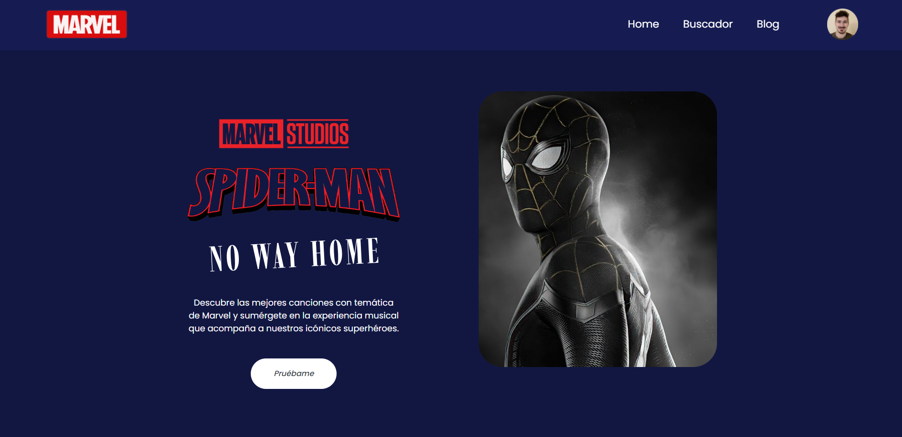
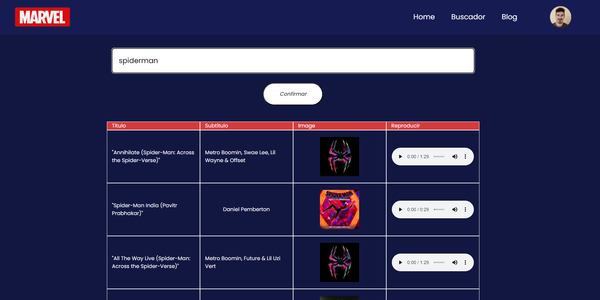
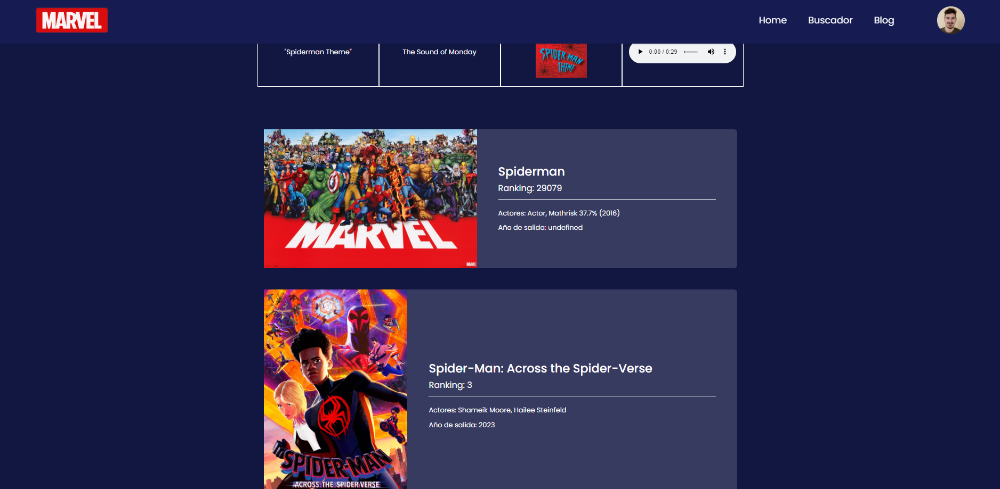
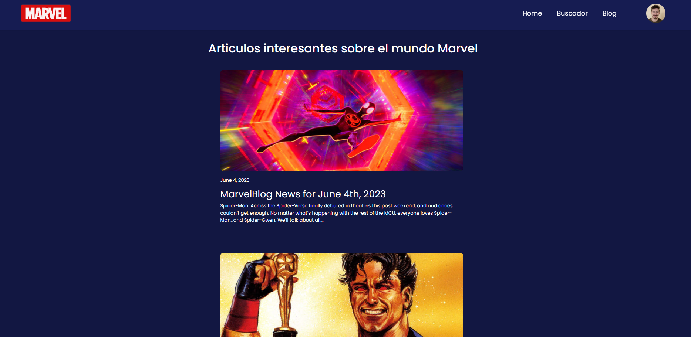
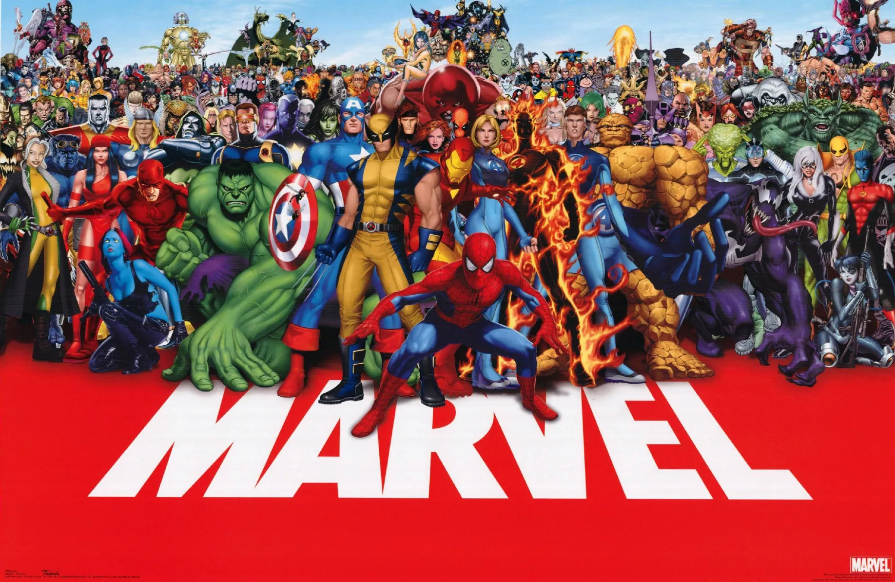

# Marvel in Tune
Prácticas Ingeniería de Sistemas 2022-23

**Descripción del proyecto:** 

Hemos creado un proyecto que creemos es innovador y tiene sentido. Nuestra idea se basa en utilizar los datos sobre las películas y personajes de Marvel, y mezclarlos con el mundo de la música. De esta manera, se podrá explorar el mundo de Marvel desde una perspectiva musical única que permitirá apreciarlo de una manera que no se había imaginado antes. En nuestra página web, podrás encontrar música relacionada con tus películas o personajes favoritos de Marvel, junto con un apartado llamado 'Blog' en el que encontrarás las últimas noticias para estar siempre al día.


*Miembros:*

 * :bust_in_silhouette:   Mauricio Luque Jiménez     :octocat:     
 * :bust_in_silhouette:  María Rabaneda Sierra     :octocat:


*Enlace URL pública:*  [Marvel In Tune App](https://back-api-dot-single-nebula-380811.ey.r.appspot.com/)


-----
### Cómo desplegar la aplicación web de Django

Ya sea dentro o fuera de un entorno virtual de Python (a elección):

```
$ pip install -r requirements.txt
$ python manage.py collectstatic

```
### Cómo levantar el contenedor para visualizar el contenido en local

En la terminal, situados en la carpeta donde tenemos el Dockerfile, docker-compose y requirements.txt:

```
$ docker build -t nombre_imagen .
$ docker-compose up
```

-----

## Visualización del proyecto:

### Landing Page / Home



### Buscador de canciones



### Buscador de películas



### Blog



-----

*Detalles a tener en cuenta:*
* A la hora de buscar en nuestra aplicación web, no detecta los espacios " ", así que es recomendable realizar las busquedas con *guiones* en su lugar.
* A la hora de visualizar las películas tras la búsqueda, si se da el caso de que la petición API no devuelve ninguna imagen, hemos puesto la siguiente por defecto:



-----